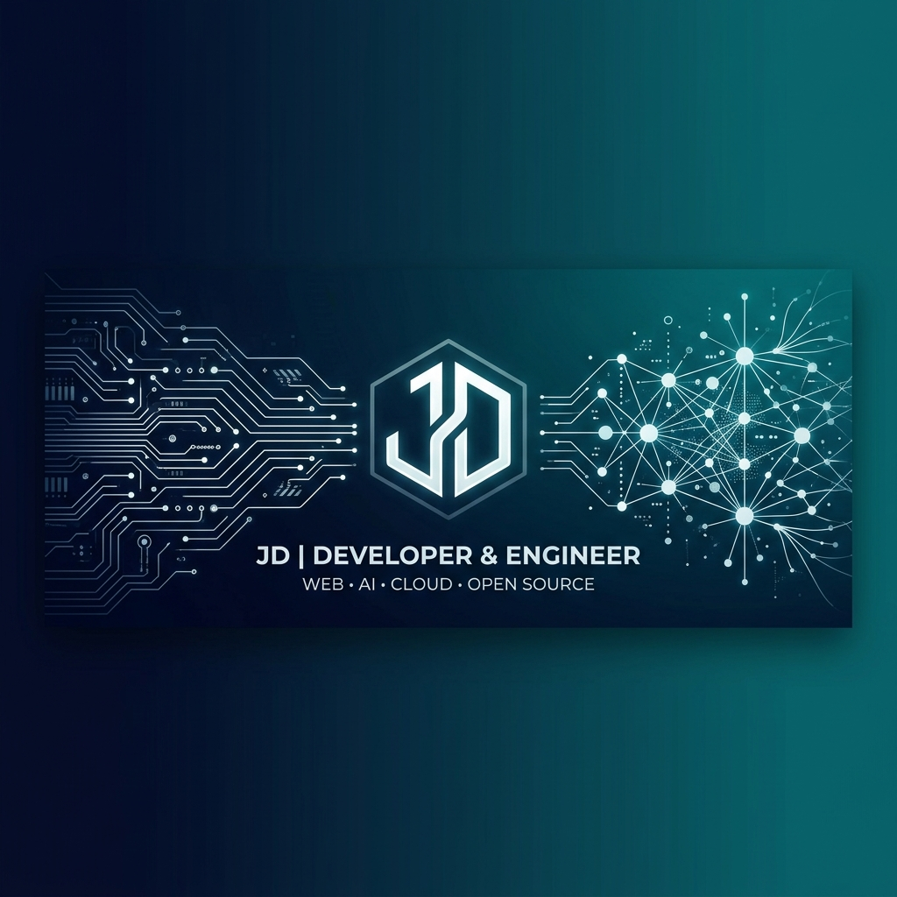
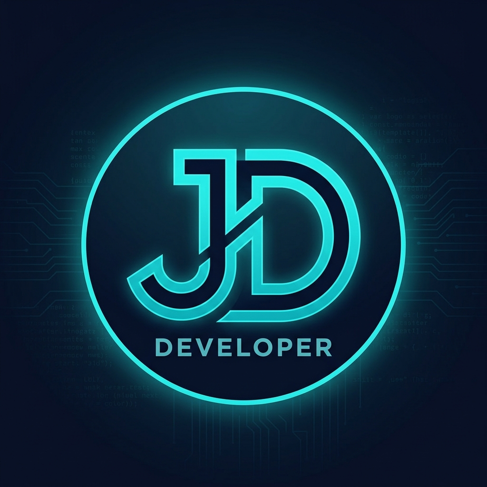

<!-- Hero Banner -->
<p align="center">
  
</p>

<!-- Title -->
<h1 align="center">
  
  &nbsp; JAY DUKARE
</h1>

<p align="center">
  <samp><b>Machine‑Learning Engineer · Embedded Systems Developer · IoT Architect</b></samp>
</p>

<!-- Typing SVG -->
<p align="center">
  <a href="https://github.com/Jay5852">
    
  </a>
</p>

<!-- Quick Links -->
<p align="center">
  <a href="mailto:jaydukare2003@gmail.com?subject=Opportunity%20for%20Jay%20Dukare&body=Hi%20Jay,%0D%0AI%20found%20your%20GitHub%20profile%20and%20would%20love%20to%20discuss%20an%20opportunity.">
    
  </a>&nbsp;
  <a href="https://linkedin.com/in/jaydukare" target="_blank">
    
  </a>&nbsp;
  <a href="https://github.com/Jay5852">
    
  </a>&nbsp;
  <a href="tel:+918624965858">
    
  </a>
</p>

<p align="center">
  
  
</p>

---

## 🧬 About Me

```text
🎓  Final-year B.E. (Electronics & Telecom) @ PES Modern College of Engineering, Pune
🤖  ML Engineer  →  XGBoost · SHAP · Scikit-learn · Streamlit · PyTorch · Transformers
🔌  Embedded Dev →  STM32 bare-metal · ESP32/ESP8266 · KiCad PCB · FreeRTOS · DMA/ISR
🌐  IoT Architect → Firebase · MQTT · Adafruit IO · Cloud-sync sensor networks
💡  I bridge the gap between AI algorithms and edge hardware to build intelligent physical devices.
```

> **Most developers build software in a vacuum. Most hardware engineers write firmware without understanding modern AI.**
> **I bridge that divide** — writing register-level bare-metal firmware, designing custom multilayer PCBs, *and* deploying production ML pipelines — creating complete, end-to-end intelligent physical systems.

---

## 📊 GitHub Analytics

<p align="center">
  <a href="https://github.com/Jay5852">
    
  </a>
  <a href="https://github.com/Jay5852">
    
  </a>
</p>

<p align="center">
  <a href="https://github.com/Jay5852">
    
  </a>
</p>

<p align="center">
  <a href="https://github.com/Jay5852">
    
  </a>
</p>

<!-- Activity graph -->
<p align="center">
  <a href="https://github.com/Jay5852">
    
  </a>
</p>

---

## 🛠️ Technical Arsenal

<table align="center" width="100%">
  <tr>
    <td valign="top" width="50%">
      <h3 align="center">🤖 AI / Machine Learning / Data Science</h3>
      <p align="center">
        
        
         <br />
        
        
         <br />
        
        
         <br />
        
        
        
      </p>
      <p align="center"><samp>Supervised Learning · NLP · Feature Engineering · Explainable AI (XAI) · Model Deployment</samp></p>
    </td>
    <td valign="top" width="50%">
      <h3 align="center">🔌 Embedded Systems / IoT / Firmware</h3>
      <p align="center">
        
        
         <br />
        
        
         <br />
        
        
         <br />
        
        
        
      </p>
      <p align="center"><samp>Bare-Metal Drivers · DMA/ISR · UART/I2C/SPI · PCB Design · Signal Integrity · Power Supply</samp></p>
    </td>
  </tr>
</table>

<details>
<summary>🧰 <b>Tools & Platforms</b> (click to expand)</summary>
<br />
<p align="center">
  
  
  
  
  
  
  
  
</p>
</details>

---

## 🚀 Flagship Projects

### 🧠 Machine Learning & Data Science

<table width="100%">
  <tr>
    <td width="50%">
      <h4>📈 Customer Churn Prediction Engine</h4>
      <p><i>End-to-end ML pipeline with explainability dashboard</i></p>
      <ul>
        <li>🎯 <b>87%+ F1 Score</b> using XGBoost with Optuna HPO</li>
        <li>🔍 SHAP integration for full model transparency</li>
        <li>🚀 Live Streamlit app for real-time predictions</li>
      </ul>
      <p>
        
        
        
        
      </p>
      <a href="https://github.com/Jay5852/customer-churn-prediction"><b>📂 View Repository →</b></a>
    </td>
    <td width="50%">
      <h4>🤖 NLP Sentiment Classifier (DistilBERT)</h4>
      <p><i>Fine-tuned transformer deployed on HuggingFace Spaces</i></p>
      <ul>
        <li>🎯 <b>92%+ Binary Accuracy</b> on movie review corpus</li>
        <li>🚀 Live Gradio app on HuggingFace Spaces</li>
        <li>📦 Model weights & architecture fully hosted</li>
      </ul>
      <p>
        
        
        
      </p>
      <a href="https://github.com/Jay5852/movie-sentiment-analyzer"><b>📂 View Repository →</b></a>
    </td>
  </tr>
  <tr>
    <td width="50%">
      <h4>🏭 Predictive Maintenance for Manufacturing</h4>
      <p><i>Industrial sensor telemetry → failure prediction & RUL</i></p>
      <ul>
        <li>📊 Analyzes temperature, vibration, rotational speed</li>
        <li>⚙️ Classification & regression for downtime prevention</li>
        <li>🏗️ Bridges AI and industrial automation</li>
      </ul>
      <p>
        
        
        
      </p>
      <a href="https://github.com/Jay5852/predictive-maintenance"><b>📂 View Repository →</b></a>
    </td>
    <td width="50%">
      <h4>🎬 Movie Recommender System</h4>
      <p><i>Collaborative filtering on dense user-item matrices</i></p>
      <ul>
        <li>🔄 Matrix factorization for personalized suggestions</li>
        <li>⚡ Optimized Pandas/NumPy data workflows</li>
        <li>📈 Historical behavior-based recommendation</li>
      </ul>
      <p>
        
        
        
      </p>
      <a href="https://github.com/Jay5852/movie-recommender"><b>📂 View Repository →</b></a>
    </td>
  </tr>
</table>

---

### 🔌 Embedded Systems & IoT

<table width="100%">
  <tr>
    <td width="50%">
      <h4>🔬 STM32 Custom Board & Bare-Metal Drivers</h4>
      <p><i>Production-ready PCB with register-level firmware</i></p>
      <ul>
        <li>🎯 2-layer PCB for STM32F446RETx in KiCad</li>
        <li>⚡ USB Micro-B, LD1117S33 LDO, 8 MHz XTAL, SWD debug</li>
        <li>🔧 Bare-metal UART & ADC via DMA/ISR — <b>zero HAL</b></li>
      </ul>
      <p>
        
        
        
      </p>
      <a href="https://github.com/Jay5852/stm32-custom-board"><b>📂 View Repository →</b></a>
    </td>
    <td width="50%">
      <h4>📟 Attendify – IoT Biometric Attendance</h4>
      <p><i>ESP32 + fingerprint sensor + Firebase cloud sync</i></p>
      <ul>
        <li>🔐 R307 fingerprint sensor with offline-first architecture</li>
        <li>☁️ Real-time Firebase sync + automated CSV reports</li>
        <li>📈 <b>80% reduction</b> in manual attendance time</li>
      </ul>
      <p>
        
        
        
      </p>
      <a href="https://github.com/Jay5852/attendance-system"><b>📂 View Repository →</b></a>
    </td>
  </tr>
  <tr>
    <td width="50%">
      <h4>⚡ Underground Cable Fault Detector</h4>
      <p><i>Resistive sensing with IoT dashboard alerts</i></p>
      <ul>
        <li>🎯 3-phase fault detection with <b>±1 km precision</b></li>
        <li>📡 ESP8266 Wi-Fi bridge → Adafruit IO dashboard</li>
        <li>📈 <b>60% faster</b> fault isolation time</li>
      </ul>
      <p>
        
        
        
      </p>
      <a href="https://github.com/Jay5852/underground-cable-fault-detection"><b>📂 View Repository →</b></a>
    </td>
    <td width="50%">
      <h4>🚪 Fingerprint Smart Door Lock</h4>
      <p><i>Biometric authentication with solenoid control</i></p>
      <ul>
        <li>🔐 Fingerprint module + 12V solenoid lock</li>
        <li>📟 I2C LCD for real-time status display</li>
        <li>🔒 Secure access control system</li>
      </ul>
      <p>
        
        
        
      </p>
      <a href="https://github.com/Jay5852/smart-door-lock"><b>📂 View Repository →</b></a>
    </td>
  </tr>
</table>

---

### 🤖 Bonus: AI Assistant

<table width="100%">
  <tr>
    <td>
      <h4>🗣️ Jarvis – AI Virtual Assistant</h4>
      <p><i>Voice-powered assistant with Google Gemini AI integration</i></p>
      <ul>
        <li>🎙️ SpeechRecognition + gTTS for voice I/O</li>
        <li>🧠 Context-aware responses via Google Gemini AI</li>
        <li>⚡ <b>70% faster</b> task completion (browsing, music, data retrieval)</li>
      </ul>
      <p>
        
        
        
      </p>
      <a href="https://github.com/Jay5852/jarvis-ai"><b>📂 View Repository →</b></a>
    </td>
  </tr>
</table>

---

## 🎓 Education & Credentials

<table align="center" width="100%">
  <tr>
    <td valign="top" width="50%">
      <h4>📚 Education</h4>
      <ul>
        <li>
          <b>P.E.S. Modern College of Engineering, Pune</b><br />
          <samp>B.E. in Electronics & Telecommunication | 2023 – Present</samp><br />
          📊 SGPA: <b>8.26 / 10.00</b>
        </li>
        <li>
          <b>Government Polytechnic, Pune</b><br />
          <samp>Diploma in ENTC | 2020 – 2023</samp><br />
          📊 Score: <b>84.39%</b>
        </li>
        <li>
          <b>V.S. Satav High School, Wagholi</b><br />
          <samp>SSC Board | 2020</samp><br />
          📊 Score: <b>91.20%</b>
        </li>
      </ul>
    </td>
    <td valign="top" width="50%">
      <h4>💼 Experience & Leadership</h4>
      <ul>
        <li>
          <b>Industrial Automation Intern</b><br />
          <samp>Pretech Automation Pvt. Ltd., Pune | Jul–Sep 2022</samp><br />
          🔧 PLC panel wiring, testing & validation of 5+ industrial systems
        </li>
        <li>
          <b>🏆 Head Organizer, IoT Hackathon 2023‑24</b><br />
          <samp>Mpulse Xtronica, PESMCOE</samp><br />
          👥 Led planning & execution for <b>50+ participants</b>
        </li>
        <li>
          <b>🥇 Finalist – CircuitVista 2K25</b><br />
          <samp>Hardware Design Competition</samp>
        </li>
      </ul>
    </td>
  </tr>
</table>

---

## 📬 Let's Build Something Extraordinary

<p align="center">
  <samp>
    Looking for a <b>multidisciplinary engineer</b> who can write bare-metal firmware,<br />
    design custom PCBs, <i>and</i> deploy production ML models?<br />
    <b>Let's connect.</b>
  </samp>
</p>

<p align="center">
  <table align="center" style="border: 1px solid #30363d; border-radius: 8px;">
    <tr>
      <td align="center" style="padding: 20px;">
        📍 <b>Location:</b> Pune, Maharashtra, India<br />
        📧 <b>Email:</b> <a href="mailto:jaydukare2003@gmail.com">jaydukare2003@gmail.com</a><br />
        🤝 <b>LinkedIn:</b> <a href="https://linkedin.com/in/jaydukare" target="_blank">linkedin.com/in/jaydukare</a><br />
        📱 <b>Phone:</b> <a href="tel:+918624965858">+91 8624965858</a><br />
        ⚡ <b>Status:</b> <code>Open to Internships & Full-Time Roles</code>
      </td>
    </tr>
  </table>
</p>

---

<p align="center">
  
</p>

<p align="center">
  <sub>🔥 Crafted with precision for Technical Recruiters & Engineering Leaders</sub>
</p>
